# 🖼️ 전자 액자 만들기

## 🎯 학습 목표

이번 학습에서는 **전자 액자 앱**을 만들어보며 다음 내용을 익혀보겠습니다:

- **이미지 롤링 표시**: 5개의 이미지를 자동으로 순환하며 표시
- **사용자 상호작용**: 좌우 스와이프로 수동 이미지 변경 가능
- **타이머 기능**: 특정 주기마다 자동으로 함수 실행
- **생명주기 관리**: StatefulWidget의 생명주기 활용

## 📋 학습 순서

```mermaid
graph LR
    A[🔍 사전 지식] --> B[⚙️ 사전 준비]
    B --> C[🎨 레이아웃 구상]
    C --> D[💻 구현하기]
    D --> E[🧪 테스트하기]
```



## 🛠️ 핵심 기술 스택

| **기술** | **역할** | **중요도** |
|:---:|:---|:---:|
| **PageView** | 페이지 스와이프 및 이미지 전환 | ⭐⭐⭐ |
| **Timer** | 자동 이미지 롤링 기능 | ⭐⭐⭐ |
| **StatefulWidget** | 상태 관리 및 생명주기 | ⭐⭐⭐ |

## 📚 사전 지식

### 🔄 위젯의 생명주기
위젯의 **생명주기(Lifecycle)**는 위젯이 화면에 그려지는 순간부터 삭제되는 순간까지의 전체 과정을 의미합니다.

> 💡 **중요**: 생명주기를 이해하면 메모리 누수 방지와 성능 최적화에 큰 도움이 됩니다!

### ⚡ StatelessWidget

**StatelessWidget의 생명주기:**
1. **생성자 실행**: StatelessWidget 인스턴스 생성
2. **build() 실행**: UI 구성 요소 반환
3. **렌더링**: build()가 반환한 Widget이 화면에 표시

```dart
class MyStatelessWidget extends StatelessWidget {
  // 1. 생성자 실행
  const MyStatelessWidget({Key? key}) : super(key: key);

  // 2. build 함수 실행
  @override
  Widget build(BuildContext context) {
    return Text('Hello World!'); // 3. 화면에 렌더링
  }
}
```

> ⚠️ **주의**: StatelessWidget은 **불변(Immutable)** 특성을 가집니다. 상태가 변경되면 인스턴스를 새로 생성해야 합니다.

### 🔄 StatefulWidget

**StatefulWidget**은 내부 상태를 가질 수 있는 위젯입니다. 외부 매개변수 변경 시의 동작은 StatelessWidget과 유사하지만, **내부에서 build() 함수를 재실행**할 수 있다는 점이 다릅니다.

StatefulWidget에는 **3가지 핵심 생명주기**가 있습니다:

| **유형** | **발생 시점** | **주요 메서드** |
|:---:|:---|:---|
| **🔄 기본 생명주기** | 위젯 최초 생성 시 | `initState()` → `build()` |
| **📝 매개변수 변경** | 부모에서 새 매개변수 전달 | `didUpdateWidget()` → `build()` |
| **⚡ 상태 변경** | `setState()` 호출 시 | `setState()` → `build()` |

**상태 변경이 없는 생명주기**
<div style="text-align: center;">
  
</div>

위 다이어그램은 StatefulWidget의 기본 생명주기를 보여줍니다:
1. **생성자 실행**: StatefulWidget이 생성됩니다
2. **createState()**: State 객체를 생성합니다
3. **initState()**: 위젯이 처음 생성될 때 한 번만 호출됩니다
4. **didChangeDependencies()**: State가 의존하는 값이 변경되면 호출됩니다
5. **dirty → build() → clean**: UI 렌더링 사이클입니다
6. **didUpdateWidget() / setState()**: 상태 변경 시 build()를 재호출합니다
7. **deactivate() / dispose()**: 위젯이 제거될 때 리소스를 정리합니다

**StatefulWidget 생성자의 매개변수가 변경됐을 때 생명주기**
<div style="text-align: center;">
  
</div>

위 다이어그램은 부모 위젯에서 매개변수가 변경되었을 때의 생명주기입니다:
1. **새로운 생성자**: 부모가 새로운 매개변수로 위젯을 재생성합니다
2. **didUpdateWidget()**: 기존 위젯과 새 위젯을 비교하여 변경사항을 처리합니다
3. **dirty → build() → clean**: 변경된 매개변수를 반영하여 UI를 다시 렌더링합니다

**State 자체적으로 build()를 재실행할 때 생명주기**

setState() 함수를 실행해서 build() 함수를 자체적으로 재실행할 수 있습니다.

<div style="text-align: center;">
  
</div>

위 다이어그램은 setState() 함수를 호출했을 때의 생명주기입니다:
1. **setState() 호출**: 상태 변경을 프레임워크에 알리고 build() 재실행을 요청합니다
2. **dirty → build() → clean**: 변경된 상태를 반영하여 UI를 다시 렌더링합니다

이는 가장 일반적인 UI 업데이트 패턴으로, 사용자 상호작용이나 데이터 변경 시 사용됩니다.

### Timer

Timer는 특정 시간이 지난 후에 일회성 또는 지속적으로 함수를 실행한다.

```dart
Timer( // 한번 실행
  Duration(seconds: 3), // 주기
  (Timer timer) {}, // 콜백 함수
) 
Timer.periodic( // 주기적으로 실행
  Duration(seconds: 3), // 주기
  (Timer timer) {}, // 콜백 함수
)
```

## 구현하기

### PageView 구현하기

PageView는 여러 개의 위젯을 단독 페이지로 생성하고 가로 또는 세로 스와이프로 페이지를 넘길 수 있게 하는 위젯이다.

| BoxFit 속성 | 설명 |
| --- | --- |
| BoxFit.contain | 가로세로 비율을 유지하면서 이미지가 박스 안에 완전히 들어가도록 조절 |
| BoxFit.cover | 가로세로 비율을 유지하면서 박스를 완전히 채우도록 조절 (이미지 일부 잘릴 수 있음) |
| BoxFit.fill | 가로세로 비율을 무시하고 박스를 완전히 채우도록 늘이거나 줄임 |
| BoxFit.fitHeight | 높이에 맞춰 이미지를 조절하고, 너비는 비율에 맞춰 조절 |
| BoxFit.fitWidth | 너비에 맞춰 이미지를 조절하고, 높이는 비율에 맞춰 조절 |
| BoxFit.none | 이미지 원본 크기를 유지하고 박스 중앙에 배치 |
| BoxFit.scaleDown | contain과 none 중 더 작은 크기로 조절 |

### 상태바 색상 변경하기

상태바는 앱을 실행 중 핸드폰 배터리, 시간, 와이파이 연결 상태 등을 보여주는 영역이다.

```dart
SystemChrome.setSystemUIOverlayStyle(SystemUiOverlayStyle.light); 
```

`SystemChrome` 클래스는 시스템 UI의 그래픽 설정을 변경하는 기능을 제공합니다.

**SystemChrome 함수**

| 함수 | 설명 |
| --- | --- |
| setEnabledSystemUIMode() | 시스템 UI 모드를 설정 (전체화면, 상태바/네비게이션바 표시 등) |
| setPreferredOrientations() | 화면 회전 방향을 제한 (세로모드, 가로모드 등) |
| setSystemUIChangeCallback() | 시스템 UI 변경 시 콜백 함수를 등록 |
| setSystemUIOverlayStyle() | 상태바와 네비게이션바의 스타일을 설정 |

### ⏰ 자동 롤링 타이머 추가

**자동 롤링 기능**을 추가하려면 `StatefulWidget`을 사용해야 합니다. 왜까요?

> ⚠️ **주의**: StatelessWidget에서 `build()` 함수 내부에 Timer를 등록하면, 위젯이 리빌드될 때마다 **새로운 Timer가 계속 생성**되어 메모리 누수가 발생합니다! 🚨

**StatefulWidget**을 사용하면 `initState()`에서 **딱 한 번만** Timer를 생성할 수 있습니다:

```dart
class PhotoFrameState extends State<PhotoFrame> {
  PageController _pageController = PageController();
  Timer? _timer;

  @override
  void initState() {
    super.initState();

    // ✨ 자동 롤링 타이머 설정 (3초마다)
    _timer = Timer.periodic(Duration(seconds: 3), (timer) {
      // 현재 페이지 가져오기
      double? currentPage = _pageController.page;
      int nextPage = currentPage == null ? 1 : (currentPage.round() + 1) % 5;

      // 다음 페이지로 이동
      _pageController.animateToPage(
        nextPage,
        duration: Duration(milliseconds: 500),
        curve: Curves.easeInOut,
      );
    });
  }

  @override
  void dispose() {
    _timer?.cancel(); // 🧹 리소스 정리
    _pageController.dispose();
    super.dispose();
  }
}
```

**PageController**를 사용해서 PageView의 현재 페이지를 가져올 수 있습니다:

#### 📊 PageController 사용법

| **메서드** | **기능** | **반환값** |
|:---:|:---|:---|
| **`.page`** | 현재 페이지 번호 | `double?` (스와이프 중에는 소수점) |
| **`.animateToPage()`** | 애니메이션과 함께 이동 | `Future<void>` |
| **`.nextPage()`** | 다음 페이지로 이동 | `Future<void>` |

> 💡 **꿀팁**: `pageController.page`가 `null`일 수 있으므로 항상 null 체크를 해주세요!

## 🏆 마무리

### ✨ 오늘 배운 것

이번 **전자 액자 프로젝트**를 통해 다음과 같은 소중한 기술들을 마스터했습니다:

| **기술** | **학습 내용** | **실제 응용** |
|:---:|:---|:---|
| **📋 PageView** | 스와이프 기능, PageController 사용법 | 사진 앱, 온보딩 화면 |
| **⏰ Timer** | 자동 실행, 주기적 작업, 메모리 관리 | 배너 롤링, 알람, 실시간 업데이트 |
| **🔄 StatefulWidget** | 3가지 생명주기 패턴, 상태 관리 | 모든 동적 UI, 인터랙티브 앱 |
| **🎨 SystemChrome** | 상태바 스타일링, 화면 방향 | 전체화면 앱, 게임, 미디어 앱 |
| **🖼️ BoxFit** | 이미지 조절 방식 7가지 | 갤러리, 프로필, 상품 이미지 |

### 🚀 다음 계획

오늘 학습한 내용을 바탕으로 다음과 같은 더 멋진 프로젝트를 시도해볼 수 있습니다:

- **🎨 고급 사진 에디터**: 필터, 회전, 자르기 기능
- **🎵 음악 플레이어**: 자동 재생, 플레이리스트
- **📱 소셜 미디어 앱**: 인피니트 스크롤, 이미지 업로드
- **🎮 미니 게임**: 애니메이션, 버튼 인터랙션

> 💪 **성장 팁**: 오늘 배운 StatefulWidget 생명주기는 Flutter 개발의 핵대가 되는 중요한 개념입니다. 계속 연습해서 마스터하세요!