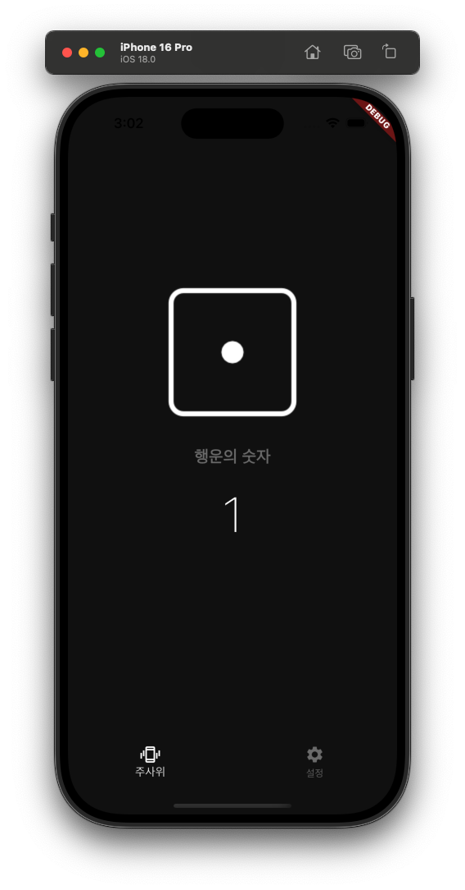
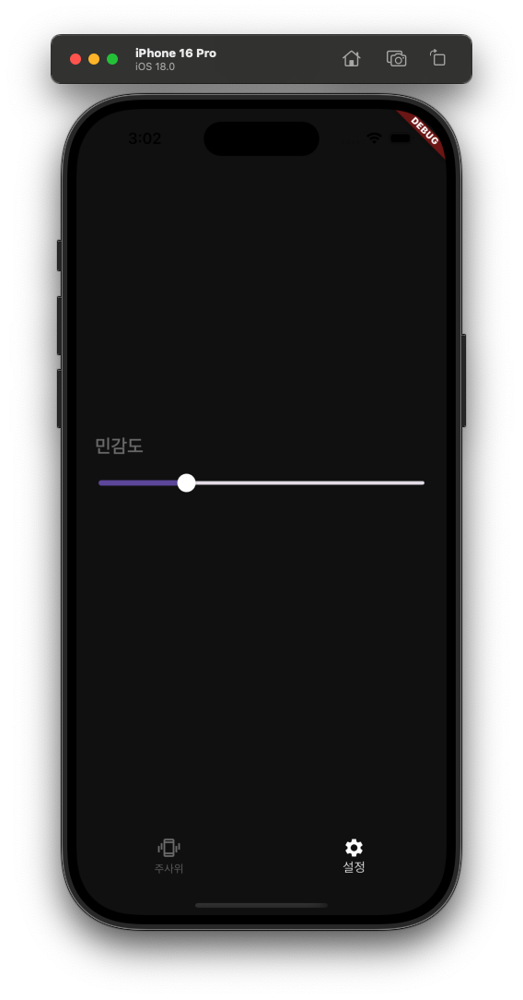

# 📖 Flutter 디지털 주사위 앱 만들기

## 🎯 학습 목표
- **디지털 주사위 앱** 만들기
- **TabController와 TickerProviderStateMixin** 활용법 익히기
- **가속도계와 자이로스코프** 원리 이해하기
- **획들림 감지 기능** 구현하기

## 📚 주요 내용

### ⭐ 프로젝트 구성 요구사항

* 가속도계는 가속도를 측정하기 때문에 어느 정도의 가속 수치를 흔드는 행동으로 인식할지에 대한 기준이 중요
* 사용자가 특정 수치를 넘는 강도로 핸드폰을 흔든 순간을 인식할 수 있는 함수를 구현
* 그 기준을 Slider 위젯을 통해 설정
* 화면 2개를 만들어 탭과 스크롤로 이동(두 화면을 각각 따로 위젯으로 구현하고 BottomNavigationBar를 이용)

### 💪 사전 지식

#### **가속도계**
가속도계를 사용하면 x,y,z 축의 측정 결과를 모두 double 값으로 반환

#### **자이로스코프**

가속도계는 x,y,z 축의 직선 움직임만 측정할 수 있다. 자이로스코프는 이 단점을 보완해서 x,u,z 축의 회전을 측정할 수 있습니다.

x: 좌우로 회전하는 방향
y: 위아래로 회전하는 방향
z: 앞뒤로 회전하는 방향

### ⚡ 핵심 구현 지식

* TabController에서 vsync 기능을 사용하려면 필수로 TickerProviderStateMixin을 사용해야합니다.
* TickerProviderStateMixin과 SingleTickerProviderMixin은 애니메이션의 효율을 올려주는 역할을 합니다.
* vsync는 TickerProviderStateMixin을 사용하는 state 클래스를 this 형태로 넣어주면 됩니다.
* 그러면 controller를 이용해서 TabBarView를 조작할 수 있습니다.

#### **TickerProviderStateMixin 심화 이해**

> 💡 **핵심**: TickerProviderStateMixin은 **"애니메이션을 위한 심장 박동기"**라고 생각하면 이해하기 쉽습니다.

**📱 Ticker: 애니메이션의 심장 박동**

애니메이션은 본질적으로 아주 짧은 시간 동안 화면을 계속해서 다시 그리는 작업입니다. 예를 들어, 1초 동안 어떤 위젯이 점점 커지는 애니메이션은 사실 1초 동안 약 60번(60fps 기준)에 걸쳐 위젯의 크기를 미세하게 키우면서 화면을 새로고침하는 것입니다.

이때, **"지금 다시 그려!", "또 다시 그려!"**와 같이 일정한 간격으로 신호를 보내주는 역할을 하는 것이 바로 `Ticker`입니다.

**🔍 TickerProviderStateMixin 이름 분석**

| **구성 요소** | **역할** | **설명** |
|:---:|:---|:---|
| **Ticker** | 심장 박동 | 애니메이션 프레임마다 신호를 주는 심장 박동 |
| **Provider** | 제공자 | Ticker를 AnimationController에게 제공하는 역할 |
| **State** | 상태 관리 | StatefulWidget의 생명주기와 애니메이션 동기화 |
| **Mixin** | 기능 추가 | `with` 키워드로 State 클래스에 기능 장착 |

**⚡ 효율성의 핵심: vsync**

- **문제 상황**: Ticker가 화면 상태와 상관없이 계속 신호를 보내면 CPU와 배터리 낭비 🔋
- **해결책**: `vsync`(Vertical Synchronization)를 통해 화면 주사율에 맞춰 동기화
- **효과**: 화면이 보일 때만 작동하고, 백그라운드 전환 시 자동으로 멈춤

* initState에서 TabController의 Listener를 등록해서 controller의 속성이 변경될 때 마다 setState를 실행해서 화면을 다시 그릴 수 있도록 합니다.


## 💻 실습 및 예제

### 🔧 실제 작성 코드

```dart
import 'package:flutter/material.dart';
import 'package:random_dice/const/colors.dart';
import 'package:random_dice/screen/home_screen.dart';
import 'package:random_dice/screen/root_screen.dart';

void main() {
  runApp(
    MaterialApp(
      theme: ThemeData(
        scaffoldBackgroundColor: backgroundColor,
        sliderTheme: SliderThemeData(
          thumbColor: primaryColor,
          activeTickMarkColor: primaryColor,
          inactiveTickMarkColor: primaryColor.withOpacity(0.3),
        ),
        bottomNavigationBarTheme: BottomNavigationBarThemeData(
          selectedItemColor: primaryColor,
          unselectedItemColor: secondaryColor,
          backgroundColor: backgroundColor,
        ),
      ),
      home: RootScreen(),
    ),
  );
}

```

```dart
import 'dart:math';

import 'package:flutter/material.dart';
import 'package:random_dice/screen/home_screen.dart';
import 'package:random_dice/screen/settings_screen.dart';
import 'package:shake/shake.dart';

class RootScreen extends StatefulWidget {
  const RootScreen({super.key});

  @override
  State<RootScreen> createState() => _RootScreenState();
}

class _RootScreenState extends State<RootScreen> with TickerProviderStateMixin {
  TabController? controller;
  double threshold = 2.7;
  int number = 1;
  ShakeDetector? shakeDetector;

  @override
  void initState() {
    super.initState();
    controller = TabController(length: 2, vsync: this);
    controller!.addListener(tabListener);

    shakeDetector = ShakeDetector.autoStart(
      // 흔들림 감지 시작
      shakeSlopTimeMS: 100, // 감지 주기
      shakeThresholdGravity: threshold,
      onPhoneShake: onPhoneShake,
    );
  }

  void onPhoneShake() {
    final rand = Random();
    setState(() {
      number = rand.nextInt(5) + 1;
    });
  }

  @override
  Widget build(BuildContext context) {
    return Scaffold(
      body: TabBarView(controller: controller, children: renderChildren()),
      bottomNavigationBar: renderBottomNavigation(),
    );
  }

  @override
  void dispose() {
    controller!.removeListener(tabListener);
    shakeDetector!.stopListening();
    super.dispose();
  }

  void tabListener() {
    setState(() {});
  }

  void onThresholdChange(double value) {
    setState(() {
      threshold = value;
    });
  }

  List<Widget> renderChildren() {
    return [
      HomeScreen(number: number),
      SettingsScreen(
        threshold: threshold,
        onThresholdChange: onThresholdChange,
      ),
    ];
  }

  BottomNavigationBar renderBottomNavigation() {
    return BottomNavigationBar(
      currentIndex: controller!.index,
      onTap: (index) {
        setState(() {
          controller!.animateTo(index);
        });
      },
      items: [
        BottomNavigationBarItem(
          icon: Icon(Icons.edgesensor_high_outlined),
          label: '주사위',
        ),
        BottomNavigationBarItem(icon: Icon(Icons.settings), label: '설정'),
      ],
    );
  }
}

```

```dart
import 'package:flutter/material.dart';
import 'package:random_dice/const/colors.dart';

class HomeScreen extends StatelessWidget {
  final int number;

  const HomeScreen({super.key, required this.number});

  @override
  Widget build(BuildContext context) {
    return Column(
      mainAxisAlignment: MainAxisAlignment.center,
      children: [
        Center(child: Image.asset('asset/img/$number.png')),
        SizedBox(height: 32),
        Text(
          '행운의 숫자',
          style: TextStyle(
            color: secondaryColor,
            fontSize: 20.0,
            fontWeight: FontWeight.w700,
          ),
        ),
        SizedBox(height: 12.0),
        Text(
          number.toString(),
          style: TextStyle(
            color: primaryColor,
            fontSize: 60.0,
            fontWeight: FontWeight.w200,
          ),
        ),
      ],
    );
  }
}

```


### 📱 구현 결과

<div align="center">
  
  <p><em>메인 주사위 화면</em></p>
</div>

<div align="center">
  
  <p><em>흔들림 감도 설정 화면</em></p>
</div>

## 📝 마무리

### ✅ 오늘 배운 것
- **TabController와 TickerProviderStateMixin**: 탭 네비게이션과 애니메이션 효율성 관리
- **가속도계와 자이로스코프**: 센서 데이터를 활용한 흔들림 감지 원리
- **ShakeDetector**: 흔들림 감지 라이브러리 활용법
- **Bottom Navigation**: 탭 바를 통한 화면 전환 구현
- **Slider Widget**: 사용자 설정값 조정 UI 구현
- **상태 관리**: 여러 화면 간 데이터 공유 및 상태 동기화

### 🚀 다음 계획
- **고급 센서 활용**: 더 정교한 제스처 인식 기능 추가
- **애니메이션 강화**: 주사위 굴리기 애니메이션 효과 구현
- **사용자 경험 개선**: 햅틱 피드백과 사운드 효과 추가
- **데이터 저장**: SharedPreferences를 활용한 설정값 영구 저장

> 💡 **핵심**: Flutter에서 센서와 탭 네비게이션을 결합하여 실용적인 앱을 만들 수 있었습니다. TickerProviderStateMixin의 중요성과 효율적인 애니메이션 관리법을 체득했습니다! 🎲