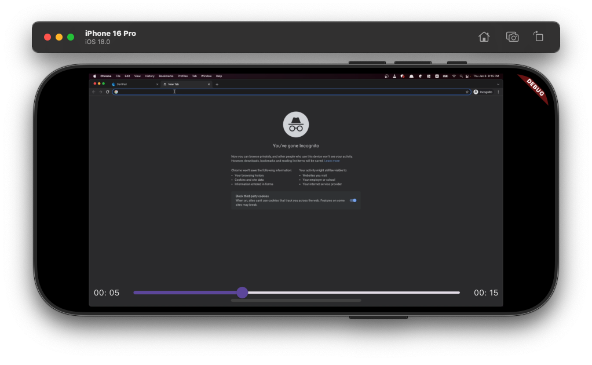
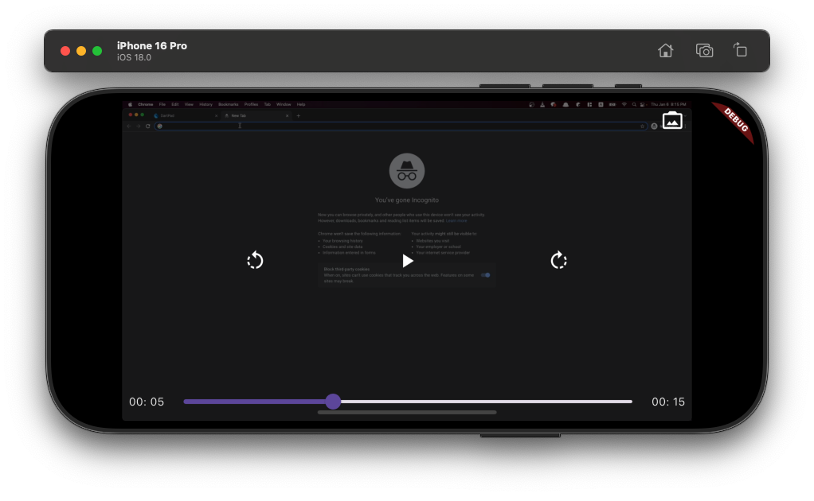
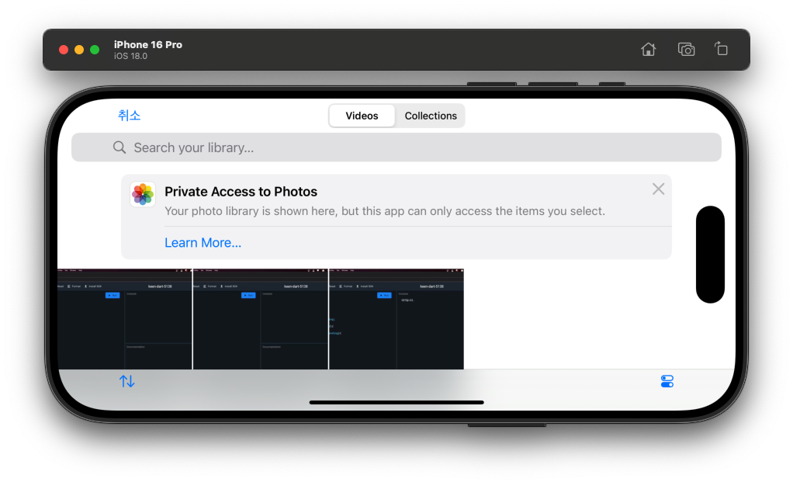

# 📖 Flutter 동영상 플레이어

## 🎯 학습 목표

동영상 플레이어 앱을 구현합니다. 핸드폰에 저장해둔 동영상을 선택하고 실행하고 컨트롤 하는 기능을 구현합니다.

## 📚 학습 순서

### ⭐ 사전 지식
* 화면 회전
* 시간 변환 및 String 패딩

### 🛠️ 사전 준비
* 가상 단말에 동영상 추가
* 이미지 추가
* pubspec.yaml
* 네이티브 설정
* 프로젝트 초기화

### 💻 구현하기
* 첫 화면
* 배경색 그라데이션
* 파일 선택 기능
* 플레이 화면
* 동영상 재생기
* 동영상 연동
* 동영상 컨트롤 버튼
* 컨트롤러 감추기
* 타임스탬프 추가

## 📚 주요 내용

### ⏰ 시간 변환 및 String 패딩

**Duration**의 경우 기간을 표시해 주는 클래스인데, `video_player` 플러그인을 사용하면서 현재 실행되고 있는 영상의 위치, 영상의 총 길이 등을 `Duration` 클래스로 반환 받게 됩니다.
하지만 실제 사용자가 좋아하는 데이터 타입이 아니기 때문에, 보기 좋은 String 값으로 바꿔주면 좋습니다.

```dart
Duration duration = Duration(seconds: 192);
print(duration); // 0:03:12.000000
print(
  '${duration.inMinutes.toString().padLeft(2, '0')}:${(duration.inSeconds % 60).toString().padLeft(2, '0')}',
); // 03:12
```

* **inMinutes** 게터는 분 단위 시간을 가져옵니다.
* **inSeconds** 겟터는 초 단위 시간을 가져오는 초 단위 시간은 분의 몫으로 넘어간 값을 제외한 나머지 값만 보여주면 됩니다.
* `String` 클래스에는 `padLeft`와 `padRight` 함수가 존재하는데 pad 함수들은 String 길이를 맞춰주는 역할을 합니다.
  * 최소 길이를 입력하고 길이가 부족한 경우 두번째 매개변수에 들어간 값을 채워 넣습니다.

> 💡 **팁**: `padLeft(2, '0')`를 사용하면 한 자리 숫자를 두 자리로 맞춰 '03', '12'처럼 표시할 수 있습니다.

### 🎨 배경색 그라데이션 구현하기

**BoxDecoration** 클래스를 사용하면 `Container` 위젯의 배경색, 테두리, 모서리 둥근 정도 등 전반적인 디자인을 변경할 수 있습니다.

### 🎬 동영상 재생기 구현하기

* **AspectRatio**는 child 매개변수에 입력되는 위젯의 비율을 정할 수 있는 위젯입니다.
* `aspectRatio` 매개변수에 원하는 비율을 입력할 수 있습니다.
* 비율은 **너비/높이**로 입력하면 되며 16:9 비율을 입력하고 싶을 때는 `16/9`를 입력하면 됩니다.
* `VideoPlayerController`를 선언하면 입력된 동영상의 비율을 `value.aspectRatio` 게터로 받아올 수 있으니 직접 넣어줬습니다.

**VideoPlayerController의 네임드 생성자**

| **생성자 이름** | **설명** |
|:---:|:---|
| `VideoPlayerController.asset` | 앱 내부 asset에서 동영상 로드 |
| `VideoPlayerController.network` | 네트워크 URL에서 동영상 로드 |
| `VideoPlayerController.file` | 로컬 파일에서 동영상 로드 |

### 🎚️ Slider 위젯 동영상과 연동하기

* **Stack** 위젯은 기본적으로 `children` 위젯들을 정중앙에 위치시킵니다.
* 만약 Stack 내부의 특정 위치에 위젯을 위치시키고 싶다면 **Positioned** 위젯을 사용해서 위치를 정할 수 있습니다.
* `bottom: 0` → Stack의 가장 아래에 자식을 위치
* 왼쪽과 오른쪽 끝까지 Slider 위젯이 늘어나게 하려고 `left`와 `right` 매개변수 모두에 0 값을 주면 왼쪽부터 0픽셀 그리고 오른쪽부터 0픽셀까지 위치 시키라는 의미가 되므로 Slider 위젯을 가로 전체로 늘릴 수 있습니다.
* **Slider** 위젯의 `min` 값은 항상 0입니다 (0초부터 시작을 해야하기 때문에).
* 최댓값은 동영상의 재생 길이를 초 단위로 변환하면 됩니다.

> 💡 **주요 메서드**
> * `videoPlayerController.seekTo()` 함수는 동영상의 재생 위치를 특정 위치로 이동해 줍니다.
> * `videoPlayerController!.value.position.inSeconds` 게터를 실행하면 현재 동영상이 실행되는 위치 값을 받을 수 있습니다.

### 🤔 Q) Player와 State의 필드의 위치가 서로 다른 상태인데 왜 이렇게 나눠서 정의 하는 게 좋을까?

플러터에서 `StatefulWidget`과 `State` 객체의 필드를 나누어 정의하는 것은 **성능 최적화**와 **데이터 관리의 명확성** 때문입니다. 이는 플러터 프레임워크의 핵심적인 동작 방식과 깊은 관련이 있습니다.

간단히 요약하면, **Widget은 '설정(Configuration)'**이고 **State는 '상태(State)'** 그 자체를 저장하기 때문입니다.

#### 1️⃣ Widget: 불변(Immutable)하는 설정 값 📜

`CustomVideoPlayer` 클래스는 `StatefulWidget`을 상속합니다. 플러터에서 Widget은 UI의 **설계도**나 **설정 값**으로 취급되며, 한 번 생성되면 그 안의 내용은 변경되지 않는 **불변(immutable) 객체**입니다.

-   **`final XFile video;`**: 이 위젯이 어떤 비디오를 재생해야 하는지에 대한 **설정**입니다. 부모 위젯으로부터 전달받습니다.
-   **`final GestureTapCallback onNewVideoPressed;`**: 버튼이 눌렸을 때 어떤 동작을 해야 하는지에 대한 **설정**입니다.

플러터는 화면을 다시 그릴 때(rebuild), 기존의 위젯을 수정하는 대신 **새로운 위젯 인스턴스를 생성**하여 교체하는 방식을 사용합니다. 만약 `videoPlayerController`처럼 계속해서 변하는 상태 값이 이 '설정' 클래스에 있다면, 화면이 다시 그려질 때마다 컨트롤러가 새로 생성되면서 이전의 재생 상태(재생 위치, 볼륨 등)를 모두 잃어버리게 됩니다. 이는 매우 비효율적이고 의도치 않은 동작을 유발합니다.

#### 2️⃣ State: 계속해서 변하고 유지되는 실제 상태 ⚙️

`_CustomVideoPlayerState` 클래스는 `State`를 상속합니다. 이 객체는 위젯 트리에서 한 번 생성되면 **쉽게 사라지지 않고 계속 유지**됩니다. 위젯(설계도)이 새롭게 교체되더라도, 플러터는 이 `State` 객체를 재사용하여 상태를 보존합니다.

-   **`VideoPlayerController? videoPlayerController;`**: 비디오의 재생, 정지 등 실제 비디오를 제어하고 현재 재생 상태(위치, 버퍼링 등)를 담고 있는 **실제 상태** 객체입니다. 이 값은 사용자의 인터랙션에 따라 계속 변해야 합니다.

`initState()`에서 컨트롤러를 초기화하고 `dispose()`에서 해제하는 등, 이 `State` 객체는 자신만의 **생명주기(Lifecycle)**를 가지며 내부 데이터를 관리합니다.

#### 3️⃣ 결론: 왜 나누는 것이 좋은가? ✅

이러한 분리 구조는 다음과 같은 핵심적인 장점을 가집니다.

1. **성능 최적화 (Performance)**: 화면이 자주 다시 그려져도(`build` 메소드 호출), `VideoPlayerController`처럼 무거운 객체나 복잡한 상태 값들은 새로 생성되지 않고 그대로 유지됩니다. **불필요한 초기화 비용을 막아** 앱 성능을 향상시킵니다.

2. **상태 보존 (State Preservation)**: 부모 위젯의 구조 변경 등으로 인해 `CustomVideoPlayer` 위젯이 새로 생성되더라도, `_CustomVideoPlayerState` 객체는 유지되므로 **비디오의 재생 위치나 상태가 초기화되지 않고 그대로 보존**됩니다.

3. **코드의 명확성 (Clarity)**: 위젯의 **설정(Configuration)**과 실제 **내부 상태(State)**가 명확하게 분리되어 코드의 역할을 이해하기 쉽고 유지보수가 용이해집니다.
   - `CustomVideoPlayer`: "이 비디오 파일(`video`)을 가지고, 이런 동작(`onNewVideoPressed`)을 하는 플레이어를 만들어 줘" 라는 **요청서**.
   - `_CustomVideoPlayerState`: 요청서의 내용을 바탕으로 비디오 컨트롤러를 만들고, 실제로 재생하고, 현재 재생 시간을 기억하는 등 모든 **실제 작업과 상태를 관리하는 주체**.

### 🔄 didUpdateWidget을 이용한 동영상 갱신

> ⚠️ **주의**: 새로운 동영상을 선택해도 화면에는 새로 선택한 영상이 실행되지 않습니다.
> * 그 이유는 동영상의 소스를 `videoController` 변수를 인스턴스화 할때 선언했는데 현재 코드에서 `videoController` 변수는 `initState` 함수에서만 선언되기 때문
> * **해결책**: `didUpdateWidget` 함수를 사용해서 새로운 동영상이 선택되었을 때 `videoController`를 새로 생성하도록 코드를 추가

**didUpdateWidget의 생명주기**
* `didUpdateWidget`의 생명주기를 잘 생각해 보면, 위젯은 매개변수의 값이 변경될 때 폐기되고 새로 생성됩니다.
* 그래서 `didUpdateWidget`의 첫번째 매개 변수에 입력되는 `oldWidget`은 폐기되는 위젯을 의미합니다.

> 💡 **covariant 키워드**: `CustomVideoPlayer` 클래스의 상속된 값도 허가해줍니다.

## 💻 실습 및 예제

### 📄 소스 코드

```dart
import 'package:flutter/material.dart';
import 'package:vid_player/screen/home_screen.dart';

void main() {
  runApp(MaterialApp(home: HomeScreen()));
}

```

```dart
import 'package:flutter/material.dart';
import 'package:image_picker/image_picker.dart';
import 'package:vid_player/screen/custom_video_player.dart';

class HomeScreen extends StatefulWidget {
  const HomeScreen({super.key});

  @override
  State<HomeScreen> createState() => _HomeScreenState();
}

class _HomeScreenState extends State<HomeScreen> {
  XFile? video;

  @override
  Widget build(BuildContext context) {
    return Scaffold(
      backgroundColor: Colors.black,
      body: video == null ? renderEmpty() : renderVideo(),
    );
  }

  Widget renderEmpty() {
    return Container(
      width: MediaQuery.of(context).size.width,
      decoration: getBoxDecoration(),
      child: Column(
        mainAxisAlignment: MainAxisAlignment.center,
        children: [
          _Logo(onTap: onNewVideoPressed),
          SizedBox(height: 30.0),
          _AppName(),
        ],
      ),
    );
  }

  BoxDecoration getBoxDecoration() {
    return BoxDecoration(
      gradient: LinearGradient(
        begin: Alignment.topCenter,
        end: Alignment.bottomCenter,
        colors: [Color(0xFF2A3A7C), Color(0XFF000118)],
      ),
    );
  }

  Widget renderVideo() {
    return Center(
      child: CustomVideoPlayer(
        video: video!,
        onNewVideoPressed: onNewVideoPressed,
      ),
    );
  }

  void onNewVideoPressed() async {
    final video = await ImagePicker().pickVideo(source: ImageSource.gallery);

    if (video != null) {
      setState(() {
        this.video = video;
      });
    }
  }
}

class _Logo extends StatelessWidget {
  final GestureTapCallback onTap;

  const _Logo({required this.onTap});

  @override
  Widget build(BuildContext context) {
    return GestureDetector(
      onTap: onTap,
      child: Image.asset('asset/img/logo.png'),
    );
  }
}

class _AppName extends StatelessWidget {
  @override
  Widget build(BuildContext context) {
    final textStyle = TextStyle(
      color: Colors.white,
      fontSize: 30.0,
      fontWeight: FontWeight.w300,
    );

    return Row(
      mainAxisAlignment: MainAxisAlignment.center,
      children: [
        Text('VEDIO', style: textStyle),
        Text('Player', style: textStyle.copyWith(fontWeight: FontWeight.w700)),
      ],
    );
  }
}

```

```dart
import 'dart:io';

import 'package:flutter/material.dart';
import 'package:image_picker/image_picker.dart';
import 'package:vid_player/component/custom_icon_button.dart';
import 'package:video_player/video_player.dart';

class CustomVideoPlayer extends StatefulWidget {
  final XFile video;
  final GestureTapCallback onNewVideoPressed;

  const CustomVideoPlayer({
    super.key,
    required this.video,
    required this.onNewVideoPressed,
  });

  @override
  State<CustomVideoPlayer> createState() => _CustomVideoPlayerState();
}

class _CustomVideoPlayerState extends State<CustomVideoPlayer> {
  VideoPlayerController? videoPlayerController;
  bool showControls = false;

  @override
  void initState() {
    super.initState();
    initializeController();
  }

  @override
  void dispose() {
    videoPlayerController?.removeListener(videoControllerListener);
    super.dispose();
  }

  @override
  void didUpdateWidget(covariant CustomVideoPlayer oldWidget) {
    super.didUpdateWidget(oldWidget);

    if (oldWidget.video.path != widget.video.path) {
      initializeController();
    }
  }

  initializeController() async {
    final videoController = VideoPlayerController.file(File(widget.video.path));

    await videoController.initialize();

    videoController.addListener(videoControllerListener);

    setState(() {
      // 굳이 할당을 setState 내부에서 하는 이유: 이렇게 해야 build를 다시 하게 되고 원하는 화면을 그려주기 때문에
      videoPlayerController = videoController;
    });
  }

  void videoControllerListener() {
    setState(() {});
  }

  @override
  Widget build(BuildContext context) {
    // 동영상 컨트롤러가 준비 중일 때
    // 최초로 build가 되는
    if (videoPlayerController == null) {
      return Center(child: CircularProgressIndicator());
    }
    return GestureDetector(
      onTap: () {
        setState(() {
          showControls = !showControls;
        });
      },
      child: AspectRatio(
        // 동영상 비율에 따른 화면 렌더링
        aspectRatio: videoPlayerController!.value.aspectRatio,
        child: Stack(
          children: [
            VideoPlayer(videoPlayerController!),
            if (showControls) Container(color: Colors.black.withOpacity(0.5)),
            Positioned(
              bottom: 0,
              right: 0,
              left: 0,
              child: Padding(
                padding: EdgeInsets.symmetric(horizontal: 8.0),
                child: Row(
                  children: [
                    renderTimeTextFromDuration(
                      videoPlayerController!.value.position,
                    ),
                    Expanded(
                      child: Slider(
                        value: videoPlayerController!.value.position.inSeconds
                            .toDouble(),
                        min: 0,
                        max: videoPlayerController!.value.duration.inSeconds
                            .toDouble(),
                        onChanged: (double val) {
                          videoPlayerController!.seekTo(
                            Duration(seconds: val.toInt()),
                          );
                        },
                      ),
                    ),
                    renderTimeTextFromDuration(
                      videoPlayerController!.value.duration,
                    ),
                  ],
                ),
              ),
            ),
            if (showControls)
              Align(
                alignment: Alignment.topRight,
                child: CustomIconButton(
                  onPressed: widget.onNewVideoPressed,
                  iconData: Icons.photo_camera_back,
                ),
              ),
            if (showControls)
              Align(
                alignment: Alignment.center,
                child: Row(
                  mainAxisAlignment:
                      MainAxisAlignment.spaceEvenly, // 자식 위젯의 간격을 동일하게 설정
                  children: [
                    CustomIconButton(
                      onPressed: onReversePressed,
                      iconData: Icons.rotate_left,
                    ),
                    CustomIconButton(
                      onPressed: onPlayPressed,
                      iconData: videoPlayerController!.value.isPlaying
                          ? Icons.pause
                          : Icons.play_arrow,
                    ),
                    CustomIconButton(
                      onPressed: onForwardPressed,
                      iconData: Icons.rotate_right,
                    ),
                  ],
                ),
              ),
          ],
        ),
      ),
    );
  }

  Widget renderTimeTextFromDuration(Duration duration) {
    return Text(
      '${duration.inMinutes.toString().padLeft(2, '0')}: ${(duration.inSeconds % 60).toString().padLeft(2, '0')}',
      style: TextStyle(color: Colors.white),
    );
  }

  void onReversePressed() {
    final currentPosition = videoPlayerController!.value.position;

    Duration position = Duration();

    if (currentPosition.inSeconds > 3) {
      position = currentPosition - Duration(seconds: 3);
    }

    videoPlayerController!.seekTo(position);
  }

  void onForwardPressed() {
    final maxPosition = videoPlayerController!.value.duration;
    final currentPosition = videoPlayerController!.value.position;

    Duration position = maxPosition;
    if ((maxPosition - Duration(seconds: 3)).inSeconds >
        currentPosition.inSeconds) {
      position = currentPosition + Duration(seconds: 3);
    }

    videoPlayerController!.seekTo(position);
  }

  void onPlayPressed() {
    if (videoPlayerController!.value.isPlaying) {
      videoPlayerController!.pause();
    } else {
      videoPlayerController!.play();
    }
  }
}

```

```dart
import 'package:flutter/material.dart';

class CustomIconButton extends StatelessWidget {
  final GestureTapCallback onPressed;
  final IconData iconData;

  const CustomIconButton({
    super.key,
    required this.onPressed,
    required this.iconData,
  });

  @override
  Widget build(BuildContext context) {
    return IconButton(
      onPressed: onPressed,
      iconSize: 30.0,
      color: Colors.white,
      icon: Icon(iconData),
    );
  }
}

```

### 📱 실행 화면

<div align="center">
  
</div>

<div align="center">
  
</div>

<div align="center">
  
</div>

## 📝 마무리

### ✅ 오늘 배운 것

- **Duration 클래스**: 동영상 재생 시간을 사용자 친화적인 형태로 변환
- **VideoPlayerController**: 동영상 로드 및 재생 제어
- **AspectRatio**: 동영상 비율에 맞춰 화면 렌더링
- **Slider 위젯**: 동영상 재생 위치 표시 및 제어
- **StatefulWidget vs State**: 설정과 상태를 분리하는 이유와 장점
- **didUpdateWidget**: 위젯 매개변수 변경 시 상태 업데이트

### 🚀 다음 계획

- 영상 통화 앱 구현
- WebRTC와 아고라 API 활용