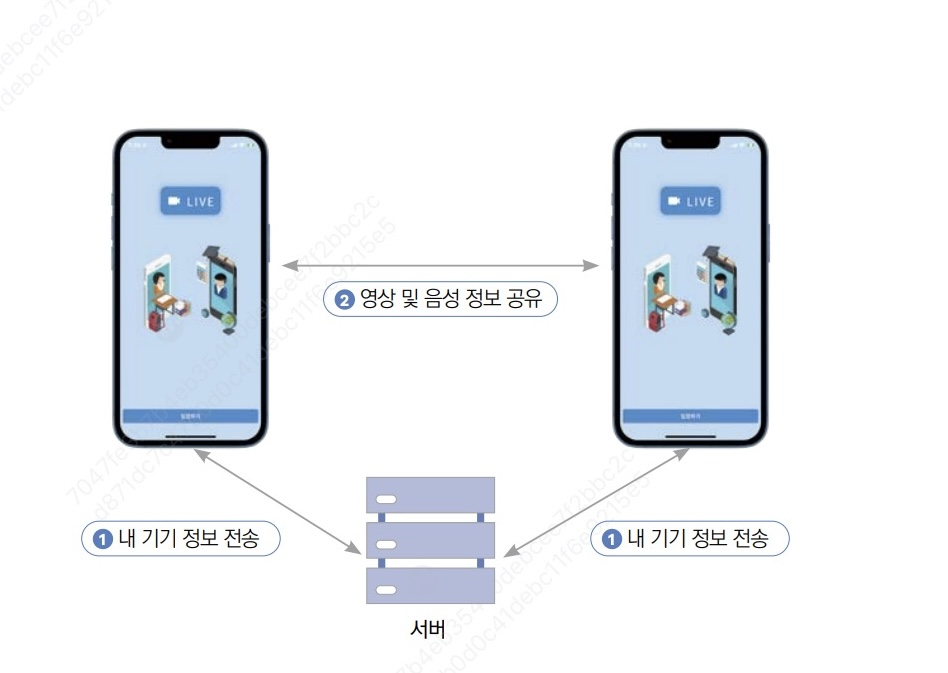

# 📖 Flutter 영상 통화 앱

## 🎯 학습 목표

아고라 API를 사용해서 간단하게 1:1 영상 통화 앱을 구현하겠습니다.

## 📚 학습 순서

### ⭐ 사전 지식
* 카메라 플러그인
* WebRTC
* 에뮬레이터에서 카메라 사용
* 내비게이션

### 🛠️ 사전 준비
* 아고라 API
* 이미지와 폰트 추가
* pubspec yaml 설정
* 네이티브 설정
* 플러터에서 권한 관리
* 프로젝트 초기화

### 💻 구현
* 홈 스크린 위젯
* 스크린 위젯

## 📋 프로젝트 구상하기

영상 통화를 하려면 동영상과 음성을 서로 전달해야 하기 때문에 **카메라 권한**과 **마이크 권한**이 필요합니다.
* `permission_handler` 플러그인을 사용해서 안드로이드와 iOS 권한을 관리하는 방법도 알아볼 예정

## 📚 주요 내용

### 📷 카메라 플러그인

**ResolutionPreset 정보**

| **ResolutionPreset 값** | **해상도** |
|:---:|:---|
| `ResolutionPreset.low` | 안드로이드와 웹 240p, 아이폰 352x288 |
| `ResolutionPreset.medium` | 안드로이드와 웹 480p, 아이폰 640x480 |
| `ResolutionPreset.high` | 안드로이드와 웹 720p, 아이폰 1280x720 |
| `ResolutionPreset.veryHigh` | 안드로이드와 웹 1080p, 아이폰 1920x1080 |
| `ResolutionPreset.ultraHigh` | 안드로이드와 웹 2160p, 아이폰 3840x2160 |
| `ResolutionPreset.max` | 최대 해상도 |

### 🌐 WebRTC

영상 통화 기능을 구현하려면 **영상과 음성 정보를 저장하고 전송하기, 클라이언트 간의 연결하기** 등 다양한 기능을 구현해야 합니다.

웹 브라우저 기반으로 통신하는 **WebRTC**라는 API가 있습니다.
* 음성 통화, 영상통화, P2P 파일 공유 기능을 제공하므로 WebRTC를 사용하면 간단히 영상 통화 기능을 구현할 수 있습니다.

> 💡 **시그널링 서버**: WebRTC를 사용하려면 두 클라이언트 말고도 중계용 서버가 필요합니다. 이 서버를 직접 구현할 수도 있지만, 앱 개발에 집중하고자 **아고라 서비스**를 이용하겠습니다.

**클라이언트와 서버간의 정보 흐름 절차**

<div align="center">
  
</div>

**WebRTC 동작 원리**
1. WebRTC를 사용할 클라이언트들은 서로에게 연결할수 있는 **공개 IP 등의 정보를 서버에 전송**
2. 서버로부터 **상대의 연결 정보를 받아옴**
3. 서버에서 받아온 정보를 기반으로 **내 영상 및 음성을 공유**하고 **상대의 영상 및 음성 정보를 수신**

### 🧭 내비게이션

**내비게이션**은 플러터에서 화면을 이동할 때 사용하는 클래스입니다.
* 내비게이션은 **스택(Stack)**이라는 데이터 구조로 설계되어 있습니다.
* 플러터에서는 내비게이션 스택의 **가장 위에 위치한 위젯**을 화면으로 보여줍니다.

**Navigator 클래스에서 제공하는 함수**

| **메서드** | **설명** |
|:---:|:---|
| `push()` | 새로운 화면을 스택에 추가 |
| `pushReplacement()` | 현재 화면을 새로운 화면으로 교체 |
| `pushAndRemoveUntil()` | 특정 조건까지 모든 화면을 제거하고 새 화면 추가 |
| `pop()` | 현재 화면을 스택에서 제거 |
| `maybePop()` | 가능한 경우에만 현재 화면 제거 |
| `popUntil()` | 특정 조건까지 계속 화면 제거 |

### 🔐 플러터에서 권한 관리

특정 기능들, 특히 **보안에 민감한 기능**은 사용자가 권한을 허가해줘야 앱에서 정보를 가져오거나 기능을 사용할 수 있습니다.
* 안드로이드와 iOS에는 허가를 받아야 하는 권한이 있고 허가를 받지 않아도 되는 권한이 있습니다 (예: 인터넷 권한).

> ⚠️ **주의**: 카메라와 마이크 권한의 경우 사용자에게 이용 허가를 꼭 받아야지만 사용할 수 있습니다. 따라서 이 권한들은 네이티브 설정을 등록을 했더라도 플러터 프레임워크에서 권한이 허가됐는지 확인해 줘야 합니다.

**permission_handler 플러그인 사용**

`permission_handler` 플러그인에서 `Permission` 클래스에 존재하는 권한을 선택한 후 `request()` 함수를 실행하면 권한을 요청할 수 있습니다.

```dart
final permission = await Permission.camera.request();

if (permission == PermissionStatus.granted) {
  // 권한 허가 완료
} else {
  // 권한 없음
}
```

**PermissionStatus 클래스**

| **값** | **설명** |
|:---:|:---|
| `denied` | 권한이 거부됨 |
| `granted` | 권한이 허가됨 |
| `restricted` | 권한이 제한됨 (iOS의 parental controls 등) |
| `limited` | 제한적으로 권한이 허가됨 (iOS 14+) |
| `permanentlyDenied` | 권한이 영구적으로 거부됨 (설정에서만 변경 가능) |

**여러 권한 동시에 요청하기**

권한을 상황에 맞게 하나씩 요청하는 경우도 있지만, 필요한 권한을 **한 번에 연속적으로 요청**할 때도 있습니다.

요청하고 싶은 권한을 순서대로 `List`에 넣어서 `request()` 함수를 실행해 주면 여러 권한을 단번에 요청할 수 있습니다.

```dart
final resp = await [Permission.camera, Permission.microphone].request();

final cameraPermission = resp[Permission.camera];
final micPermission = resp[Permission.microphone];

```

## 📝 마무리

### ✅ 오늘 배운 것

- **카메라 플러그인**: ResolutionPreset을 통한 해상도 설정
- **WebRTC**: 실시간 통신 프로토콜과 시그널링 서버의 역할
- **내비게이션**: 스택 구조를 이용한 화면 전환 관리
- **권한 관리**: permission_handler를 통한 카메라/마이크 권한 요청
- **PermissionStatus**: 권한 상태 종류와 처리 방법

### 🚀 다음 계획

- 아고라 API 설정 및 연동
- 홈 스크린과 통화 스크린 구현
- 실제 영상 통화 기능 테스트

