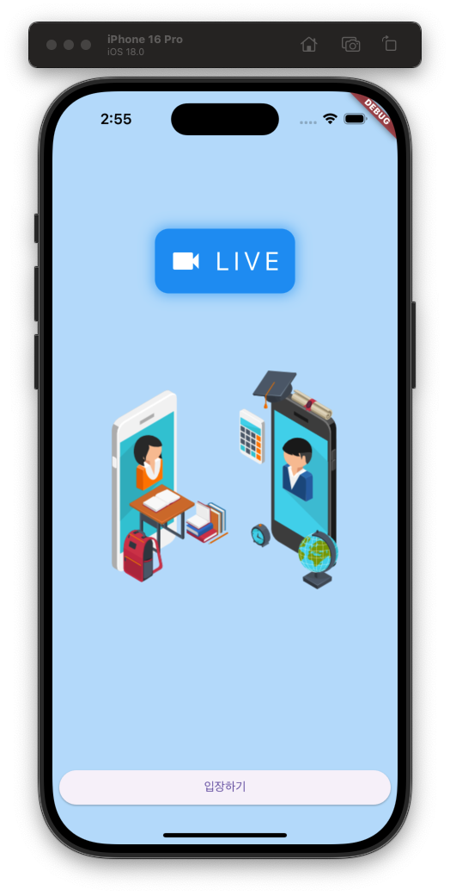

오늘은 Flutter로 영상 통화 앱을 구현하면서 Navigator와 FutureBuilder에 대해 깊이 있게 배워보았습니다. 특히 화면 전환과 비동기 처리의 핵심 개념들을 이해할 수 있었어요! 📱✨

## 🎯 학습 내용

### 1. Navigator를 활용한 화면 전환

HomeScreen에서 CamScreen으로 이동하기 위해 Navigator 클래스를 활용했습니다.

#### Navigator 기본 개념
```
MaterialApp 위젯 → Navigator 자동 생성
Navigator.of(context) → 위젯 트리에서 가장 가까운 Navigator 참조
MaterialPageRoute → 새로운 화면 정의
```

- **MaterialApp과 Navigator**: 최상위에 MaterialApp을 배치하면 자동으로 Navigator 인스턴스가 생성되어 앱 어디서든 `Navigator.of(context)`로 접근 가능
- **MaterialPageRoute**: builder() 함수에 새로운 화면 위젯을 반환하는 함수를 전달하여 화면 전환 구현

### 2. FutureBuilder로 비동기 UI 처리

FutureBuilder는 Future 결과에 따라 위젯을 렌더링할 때 사용하는 강력한 위젯입니다.

#### FutureBuilder 구조
```
future: 비동기 함수
builder: (context, snapshot) → Widget
```

#### AsyncSnapshot 주요 속성
- **hasError**: 비동기 함수 실행 중 에러 발생 여부 확인
- **hasData**: 비동기 함수에서 반환된 데이터 존재 여부 확인
- **connectionState**: 비동기 함수의 현재 실행 상태 확인

### 3. FutureBuilder의 재실행 메커니즘과 캐싱

#### 재실행 조건
- 제공된 비동기 함수의 상태가 변경될 때 builder() 함수 재실행
- 부모 위젯의 build() 함수가 재실행되면 FutureBuilder의 builder도 재실행
- builder 함수가 재실행될 때마다 비동기 함수도 다시 실행

#### 화면 깜빡임 문제 해결
`connectionState` 값만으로 대기 여부를 결정하면 builder 재실행 시마다 CircularProgressIndicator가 나타나 화면이 깜빡거립니다.

**해결 방법**: FutureBuilder의 캐싱 기능 활용
- `snapshot.data`는 이전에 실행했던 함수의 반환 값을 캐싱
- `connectionState`가 waiting이어도 `snapshot.hasData`로 기존 데이터 확인 가능
- `snapshot.hasData`를 기준으로 대기 여부를 결정하여 깜빡임 방지

## 💡 핵심 개념 정리

### Navigator 패턴
```
MaterialApp 구조:
└─ Navigator (자동 생성)
   ├─ HomeScreen
   └─ CamScreen (MaterialPageRoute로 추가)
```

### FutureBuilder 최적화
```
❌ 잘못된 방법:
if (snapshot.connectionState == waiting) → 깜빡임 발생

✅ 올바른 방법:
if (!snapshot.hasData) → 캐싱 활용으로 깜빡임 방지
```

## 작업 결과물

<div align="center">
  
</div>

## 🚀 다음 학습 목표

1. **Agora SDK 통합**: 실제 영상 통화 기능 구현
2. **권한 관리**: 카메라/마이크 권한 처리
3. **에러 핸들링**: 네트워크 끊김 등 예외 상황 처리