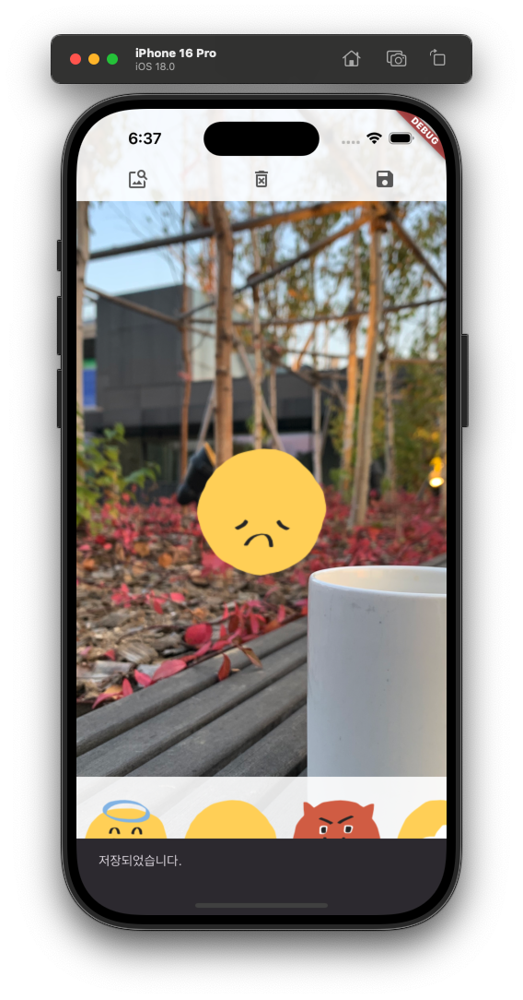

오늘은 Flutter로 이미지에 스티커를 붙여 꾸밀 수 있는 포토 에디터 앱을 구현해보았습니다. GestureDetector를 활용한 다양한 제스처 처리와 Transform 위젯을 통한 위치/크기 조절 방법을 배웠어요! 📸✨

## 🎯 학습 목표

- 이미지를 선택하고 스티커를 붙여 꾸미는 앱 구현
- 제스처를 활용한 스티커의 크기 및 위치 조절
- Transform 위젯을 사용한 UI 변환 처리

## 📚 학습 내용

### 1. GestureDetector와 제스처

Flutter에서는 GestureDetector 위젯을 통해 다양한 터치 제스처를 감지하고 처리할 수 있습니다.

#### 주요 제스처 종류

| 제스처 매개변수 | 설명 |
| --- | --- |
| onTap | 한 번 탭했을 때 실행 |
| onDoubleTap | 두 번 연속 탭했을 때 실행 |
| onLongPress | 길게 눌렀을 때 실행 |
| onScaleUpdate | 핀치/확대/축소/회전 제스처 시 실행 |
| onVerticalDragStart | 수직 드래그 시작 시 실행 |
| onVerticalDragEnd | 수직 드래그 종료 시 실행 |
| onHorizontalDragStart | 수평 드래그 시작 시 실행 |
| onHorizontalDragEnd | 수평 드래그 종료 시 실행 |
| onPanStart | 모든 방향 드래그 시작 시 실행 |
| onPanEnd | 모든 방향 드래그 종료 시 실행 |

### 2. Transform 위젯으로 위치와 크기 조절

Transform 위젯은 Matrix4를 사용하여 자식 위젯의 위치, 크기, 회전 등을 변환할 수 있습니다.

#### 주요 기능
- **translate**: 위젯의 위치 이동 (x, y, z축)
- **scale**: 위젯의 크기 조절
- **rotate**: 위젯의 회전

### 3. RepaintBoundary를 활용한 이미지 저장

RepaintBoundary는 위젯 트리의 특정 부분을 독립적인 레이어로 분리하여 이미지로 변환할 수 있게 해줍니다.

#### 이미지 저장 과정
```
1. GlobalKey로 RepaintBoundary 참조
2. RenderRepaintBoundary 객체 가져오기
3. toImage()로 ui.Image 생성
4. toByteData()로 바이트 데이터 변환
5. ImageGallerySaverPlus로 갤러리에 저장
```

## 💻 구현 코드

### HomeScreen - 메인 화면

```dart
class _HomeScreenState extends State<HomeScreen> {
  XFile? image;                    // 선택된 이미지
  Set<StickerModel> stickers = {}; // 스티커 목록 (Set으로 중복 방지)
  String? selectedId;              // 선택된 스티커 ID
  GlobalKey imgKey = GlobalKey();  // 이미지 저장을 위한 Key

  @override
  Widget build(BuildContext context) {
    return Scaffold(
      body: Stack(
        children: [
          renderBody(),
          // 상단 앱바 (이미지 선택, 저장, 삭제)
          Positioned(
            top: 0,
            left: 0,
            right: 0,
            child: MainAppBar(
              onPickImage: onPickImage,
              onSaveImage: onSaveImage,
              onDeleteImage: onDeleteImage,
            ),
          ),
          // 하단 스티커 선택 바
          if (image != null)
            Positioned(
              bottom: 0,
              left: 0,
              right: 0,
              child: Footer(onEmotionTap: onEmotionTap),
            ),
        ],
      ),
    );
  }

  // 이미지 저장 기능
  void onSaveImage() async {
    RenderRepaintBoundary boundary =
        imgKey.currentContext!.findRenderObject() as RenderRepaintBoundary;
    ui.Image image = await boundary.toImage();
    ByteData? byteData = await image.toByteData(format: ui.ImageByteFormat.png);
    Uint8List pngByte = byteData!.buffer.asUint8List();
    await ImageGallerySaverPlus.saveImage(pngByte, quality: 100);
    ScaffoldMessenger.of(context).showSnackBar(
      SnackBar(content: Text('저장되었습니다.'))
    );
  }
}
```

### EmoticonSticker - 스티커 위젯

```dart
class _EmoticonStickerState extends State<EmoticonSticker> {
  double scale = 1;          // 현재 스케일
  double hTransform = 0;     // 수평 이동 거리
  double vTransform = 0;     // 수직 이동 거리
  double actualScale = 1;    // 실제 스케일 (제스처 종료 시 저장)

  @override
  Widget build(BuildContext context) {
    return Transform(
      // Matrix4를 사용한 변환
      transform: Matrix4.identity()
        ..translate(hTransform, vTransform)  // 위치 이동
        ..scale(scale, scale),               // 크기 조절
      child: Container(
        // 선택된 스티커는 파란색 테두리 표시
        decoration: widget.isSelected
            ? BoxDecoration(
                borderRadius: BorderRadius.circular(4.0),
                border: Border.all(color: Colors.blue, width: 1.0),
              )
            : BoxDecoration(
                border: Border.all(width: 1.0, color: Colors.transparent),
              ),
        child: GestureDetector(
          onTap: widget.onTransform,  // 탭 시 선택
          onScaleUpdate: (details) {
            widget.onTransform();
            setState(() {
              // 핀치 제스처로 크기 조절
              scale = details.scale * actualScale;
              // 드래그로 위치 이동
              vTransform += details.focalPointDelta.dy;
              hTransform += details.focalPointDelta.dx;
            });
          },
          onScaleEnd: (details) {
            // 제스처 종료 시 현재 스케일 저장
            actualScale = scale;
          },
          child: Image.asset(widget.imgPath),
        ),
      ),
    );
  }
}
```

### StickerModel - 스티커 데이터 모델

```dart
class StickerModel {
  final String id;       // UUID로 생성된 고유 ID
  final String imgPath;  // 이미지 경로

  StickerModel({required this.id, required this.imgPath});

  // Set에서 중복을 제거하기 위한 동등성 비교
  @override
  bool operator ==(Object other) {
    return (other as StickerModel).id == id;
  }

  @override
  int get hashCode => id.hashCode;
}
```

## 💡 핵심 개념 정리

### GestureDetector의 제스처 처리 흐름
```
사용자 터치
  ↓
onScaleUpdate → scale, focalPointDelta 값 전달
  ↓
setState() → Transform 위젯의 matrix 업데이트
  ↓
화면에 반영 (위치/크기 변경)
  ↓
onScaleEnd → actualScale에 최종 값 저장
```

### Transform + Matrix4 변환
```
Matrix4.identity()
  ├─ translate(x, y, z) → 위치 이동
  ├─ scale(x, y, z)     → 크기 조절
  └─ rotate(angle)      → 회전
```

### RepaintBoundary 저장 과정
```
RepaintBoundary (GlobalKey로 참조)
  ↓
RenderRepaintBoundary 객체
  ↓
ui.Image (toImage())
  ↓
ByteData (toByteData())
  ↓
갤러리 저장 (ImageGallerySaverPlus)
```

## 작업 결과물

<div align="center">
  
</div>

## 🚀 다음 학습 목표

1. **회전 기능 추가**: Transform.rotate를 활용한 스티커 회전
2. **실행 취소/다시 실행**: 스티커 조작 히스토리 관리
3. **다양한 편집 기능**: 필터, 텍스트 추가 등 확장 기능 구현