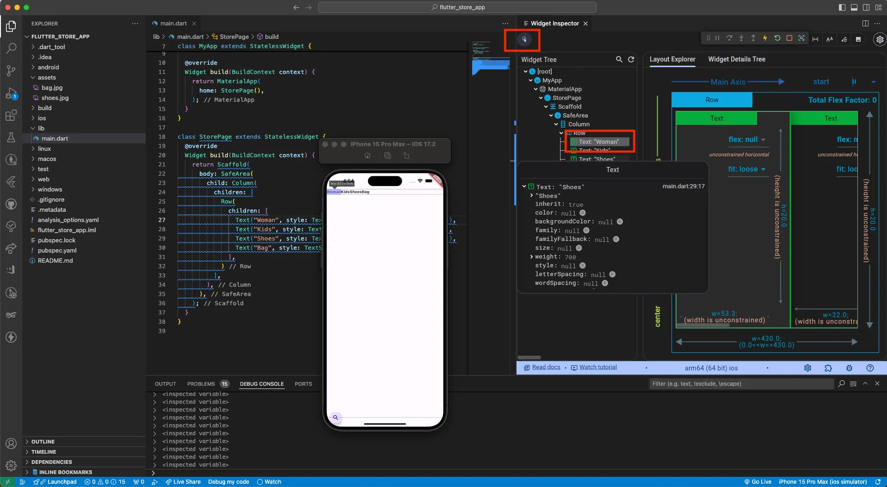

오늘은 Flutter의 기본 레이아웃 위젯인 Row와 Column을 활용하여 간단한 스토어 앱 UI를 만들어보았습니다. Text 위젯의 스타일링과 Flutter DevTools 사용법도 배웠어요!

## 🎯 학습 목표

- Row와 Column을 활용한 레이아웃 구성
- Text 위젯의 style 속성 이해
- Flutter DevTools로 UI 디버깅하기

## 📚 학습 내용

### 1. 레이아웃 나누기 및 필요한 위젯 살펴보기

스토어 앱의 UI를 구성하기 위해 레이아웃을 계층적으로 나누어봅시다.

#### 위젯 구조
```
Column
  ├─ Row (상단 카테고리 메뉴)
  │   ├─ Text (Woman)
  │   ├─ Text (Kids)
  │   ├─ Text (Shoes)
  │   └─ Text (Bag)
  ├─ Image (가방 이미지)
  └─ Image (신발 이미지)
```

### 2. Row와 Column 위젯

Flutter에서 가장 기본적이고 자주 사용되는 레이아웃 위젯입니다.

#### Row와 Column의 특징

| 위젯 | 설명 | 주요 속성 |
| --- | --- | --- |
| Row | 자식 위젯을 가로로 배치 | mainAxisAlignment, crossAxisAlignment |
| Column | 자식 위젯을 세로로 배치 | mainAxisAlignment, crossAxisAlignment |

#### Spacer 위젯
- Row나 Column 내에서 위젯 사이의 공간을 균등하게 배분
- 자동으로 남은 공간을 채워주는 편리한 위젯

### 3. Text 위젯의 style 속성

Text 위젯을 디자인할 수 있는 속성입니다.

#### 속성(Property)이란?
- 어떤 대상(Object)을 구성하고 있는 요소
- 예시: 커피라는 객체 → 이름, 온도(아이스/핫), 사이즈(L/M/S) 등의 속성

#### Text 위젯의 주요 속성

| 속성 | 설명 |
| --- | --- |
| style | 텍스트의 스타일 (TextStyle 객체) |
| overflow | 텍스트가 영역을 벗어날 때 처리 방법 |
| maxLines | 최대 줄 수 제한 |
| textAlign | 텍스트 정렬 (left, center, right) |

#### TextStyle 주요 매개변수

| 매개변수 | 설명 |
| --- | --- |
| fontSize | 글자 크기 |
| fontWeight | 글자 굵기 (bold, normal 등) |
| color | 글자 색상 |
| letterSpacing | 글자 간격 |
| height | 줄 높이 |

### 4. Flutter DevTools

DevTools는 앱의 UI 레이아웃 검사 및 성능 모니터링 등을 할 수 있는 도구입니다.

#### DevTools 실행 방법

**커맨드 팔레트 실행**
- Windows: `Ctrl + Shift + P`
- Mac: `Cmd + Shift + P`

DevTools를 실행하면 다음과 같은 기능을 사용할 수 있습니다:
- **Widget Inspector**: 위젯 트리 구조 확인 및 위젯이 차지하는 공간 시각화
- **Performance**: 앱 성능 분석
- **Network**: 네트워크 요청 모니터링
- **Logging**: 로그 확인

<div align="center">
  
</div>

## 💻 구현 코드

### StorePage - 스토어 메인 화면

```dart
import 'package:flutter/material.dart';

void main() {
  runApp(const MyApp());
}

class MyApp extends StatelessWidget {
  const MyApp({super.key});

  @override
  Widget build(BuildContext context) {
    return MaterialApp(
      debugShowCheckedModeBanner: false,
      home: StorePage(),
    );
  }
}

class StorePage extends StatelessWidget {
  const StorePage({super.key});

  @override
  Widget build(BuildContext context) {
    return Scaffold(
      body: SafeArea(
        child: Column(
          children: [
            // 상단 카테고리 메뉴
            SizedBox(
              height: 70,
              child: Padding(
                padding: EdgeInsets.symmetric(horizontal: 20),
                child: Row(
                  children: [
                    Text(
                      'Woman',
                      style: TextStyle(fontWeight: FontWeight.bold),
                    ),
                    Spacer(),
                    Text(
                      'Kids',
                      style: TextStyle(fontWeight: FontWeight.bold)
                    ),
                    Spacer(),
                    Text(
                      'Shoes',
                      style: TextStyle(fontWeight: FontWeight.bold),
                    ),
                    Spacer(),
                    Text(
                      'Bag',
                      style: TextStyle(fontWeight: FontWeight.bold)
                    ),
                  ],
                ),
              ),
            ),
            // 이미지 영역
            Expanded(
              child: Image.asset(
                'assets/bag.jpg',
                fit: BoxFit.cover
              )
            ),
            Expanded(
              child: Image.asset(
                'assets/shoes.jpg',
                fit: BoxFit.cover
              )
            ),
          ],
        ),
      ),
    );
  }
}
```

## 💡 핵심 개념 정리

### Row와 Column의 구조
```
Row (가로 배치)
  ├─ child 1
  ├─ Spacer (자동 공간 배분)
  ├─ child 2
  └─ Spacer

Column (세로 배치)
  ├─ child 1
  ├─ child 2
  └─ child 3
```

### SafeArea의 역할
```
SafeArea (안전 영역 확보)
  └─ 노치, 상태바 등을 피해 콘텐츠 배치
```

### Expanded 위젯
```
Column
  ├─ Widget (고정 크기)
  ├─ Expanded (남은 공간의 1/2)
  └─ Expanded (남은 공간의 1/2)
```

## 🚀 다음 학습 목표

1. **GridView**: 그리드 레이아웃으로 상품 목록 구현
2. **ListView**: 스크롤 가능한 리스트 구현
3. **상호작용 추가**: GestureDetector로 탭 이벤트 처리
