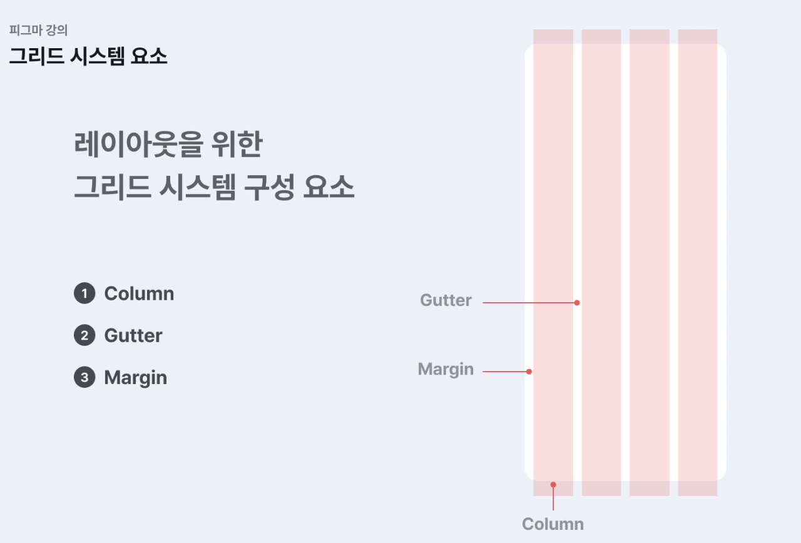
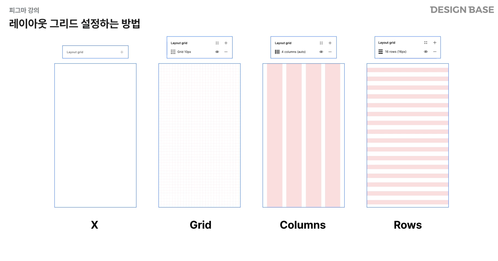

오늘은 Figma에서 레이아웃과 그리드 시스템을 활용하는 방법을 배웠어요! 앱과 웹 디자인의 차이점부터 그리드 시스템의 구성 요소, 도형과 텍스트 스타일링까지 실전에서 바로 활용할 수 있는 내용을 익혔답니다.

## 🎯 학습 목표

- **레이아웃과 그리드 시스템**의 개념과 중요성 이해하기
- **웹과 앱의 그리드 차이점** 파악하고 적절한 그리드 선택하기
- **Figma의 레이아웃 그리드 기능** 활용하여 정확한 디자인 구현하기
- **도형과 텍스트 스타일링** 도구를 사용하여 UI 요소 꾸미기
- **생산성 높이는 단축키**로 작업 효율 극대화하기

## 📚 주요 내용

### ⭐ 1. 레이아웃(Layout)이란?

**레이아웃**은 앱이나 웹사이트 내의 정보를 시각적으로 배치하는 것을 말해요. 사용자가 정보를 쉽게 이해하고 탐색할 수 있도록 화면 구성 요소를 체계적으로 배치하는 것이 핵심입니다.

#### 📌 레이아웃 구성 요소

| **요소** | **설명** | **예시** |
|:---:|:---|:---|
| **화면 크기** | 다양한 디바이스 해상도 고려 | 모바일, 태블릿, 데스크톱 |
| **텍스트** | 제목, 본문, 캡션 등의 배치 | Typography hierarchy |
| **이미지** | 시각적 콘텐츠 위치와 크기 | 썸네일, 배너, 아이콘 |
| **여백** | 요소 간 공간 (Padding, Margin) | 가독성과 시각적 편안함 제공 |

> 💡 **핵심**: 레이아웃은 단순히 예쁘게 만드는 것이 아니라, **사용자 경험(UX)**을 고려한 정보 설계예요!

### 🔲 2. 그리드 시스템(Grid System)이란?

**그리드 시스템**은 여러 구성 요소를 질서 있게 배치하기 위한 규칙이에요. 그리드를 잘 활용하면 **시각적 통일성**과 **일관성**을 줄 수 있답니다.

#### 🌐 웹 vs 앱: 그리드 차이점

| **구분** | **그리드 구조** | **특징** | **용도** |
|:---:|:---:|:---|:---|
| **반응형 웹** | **12단 그리드** | 다양한 기기와 해상도에 맞춰 유연하게 대응 | 데스크톱, 태블릿, 모바일 |
| **모바일 앱** | **4~6단 그리드** | 스마트폰의 작은 화면에 맞춘 단조로운 레이아웃 | iOS, Android 앱 |

> 💡 **Tip**: 모바일 앱 디자인 시 **4단 그리드**를 선호하는 이유는 작은 화면에서 콘텐츠가 명확하게 구분되기 때문이에요!

#### 📐 그리드 시스템의 3가지 핵심 요소

<div align="center">
  
  <p><em>그리드 시스템의 구성 요소: Column, Gutter, Margin</em></p>
</div>

```
┌─────────────────────────────────────────┐
│  Margin                       Margin    │
│  ┌───────┬───────┬───────┬───────┐     │
│  │Column │Gutter │Column │Column │     │
│  │   1   │       │   2   │   3   │     │
│  └───────┴───────┴───────┴───────┘     │
└─────────────────────────────────────────┘
```

| **요소** | **설명** | **용도** |
|:---:|:---|:---|
| **Column (컬럼)** | 몇 단으로 나눌 것인가? | 콘텐츠 배치의 기본 단위 (보통 4단 선호) |
| **Gutter (거터)** | 컬럼과 컬럼 사이의 간격 | 요소 간 시각적 분리 (보통 16~24px) |
| **Margin (마진)** | 화면 좌우 여백 | 화면 가장자리의 안전 영역 (보통 16~20px) |

### 🎨 3. Figma에서 레이아웃 그리드 설정하기

Figma에서는 **Layout Grid** 기능으로 정확한 그리드 시스템을 적용할 수 있어요.

<div align="center">
  
  <p><em>Figma의 Layout Grid 설정 패널</em></p>
</div>

#### 📌 레이아웃 그리드 3가지 타입

| **타입** | **용도** | **언제 사용?** |
|:---:|:---|:---|
| **Grid** | 작은 단위 정렬 | 아이콘, 버튼 등 작은 요소에 **4~8pt 그리드** 적용 시 |
| **Columns** | 컬럼 기반 레이아웃 | 전체 페이지 레이아웃을 **딱 맞춰** 배치할 때 (가장 많이 사용!) |
| **Rows** | 행 기반 레이아웃 | 잘 사용하지 않음 (필요 시 특정 세로 정렬에 활용) |

> ⚡ **단축키**: `Shift + G` - 레이아웃 그리드 On/Off 토글

#### 🛠️ 그리드 설정 단계

```
1. 프레임 선택
   ↓
2. 우측 패널 > Design > Layout Grid 클릭
   ↓
3. + 버튼으로 그리드 추가
   ↓
4. 타입 선택 (Grid / Columns / Rows)
   ↓
5. 세부 설정 (Count, Gutter, Margin 등)
```

#### 💡 실전 활용 팁

- **전체 페이지**: Columns 그리드 (4~6단)
- **작은 요소** (버튼, 인풋, 아이콘): Grid (8pt 또는 4pt)
- **정렬 확인**: `Shift + G`로 그리드를 켜고 끄며 확인

> ⚠️ **주의**: 그리드는 프레임 전체에 무조건 사용하는 것이 아니라, **작은 요소들의 정확한 수치 확인**이 필요할 때 활용해요!

### 🎨 4. 도형 스타일링 (Shape Styling)

Figma에서 도형을 꾸미는 다양한 도구를 배워봤어요.

#### 📌 Appearance 도구

##### ✨ Fill (채우기)

| **타입** | **설명** | **사용 예시** |
|:---:|:---|:---|
| **Solid** | 단일 색상 적용 | 버튼 배경, 아이콘 색상 |
| **Gradient** | 그라데이션 색상 | 헤더 배경, 카드 배경 |
| **Image** | 이미지 삽입 | 프로필 사진, 썸네일 |
| **Video** | 비디오 삽입 | 미리보기 실행 시 재생됨 |

##### 🖼️ Image Fill 옵션

```
Image Fill 옵션
├─ Fill    → 도형 크기만큼 이미지 채우기 (비율 무시)
├─ Fit     → 원본 이미지 비율 유지하며 맞추기
├─ Crop    → 이미지를 잘라내어 맞추기 (가장 많이 사용)
└─ Tile    → 이미지를 타일처럼 반복
```

##### 🖊️ Stroke (선)

- 각 라인의 **굵기, 색상, 스타일** 설정 가능
- **Inside / Center / Outside** 정렬 옵션
- **Dashed line** (점선) 패턴 설정

##### ✨ Effects (효과)

| **효과** | **설명** | **사용 예시** |
|:---:|:---|:---|
| **Drop Shadow** | 외부 그림자 | 카드 입체감, 버튼 강조 |
| **Inner Shadow** | 내부 그림자 | 눌린 느낌, 오목한 효과 |
| **Layer Blur** | 레이어 블러 | 배경 흐림 효과 |
| **Background Blur** | 배경 블러 | 글래스모피즘 효과 |

### 📝 5. 텍스트 스타일링 (Text Styling)

#### 📌 Typography 설정

**Type Settings**에서 다양한 텍스트 스타일링을 제공해요:

| **속성** | **설명** | **예시** |
|:---:|:---|:---|
| **Font Family** | 폰트 종류 | Pretendard, Roboto, Inter |
| **Font Weight** | 굵기 | Regular, Medium, Bold |
| **Font Size** | 크기 | 14px, 16px, 24px |
| **Line Height** | 줄 간격 | 150%, 1.5, 24px |
| **Letter Spacing** | 자간 | -2%, 0.5px |
| **Paragraph Spacing** | 단락 간격 | 16px, 24px |

> 💡 **Tip**: **Text Styles**로 자주 사용하는 텍스트 스타일을 저장하면 일관된 디자인을 유지할 수 있어요!

## ⚡ 생산성 높이는 Figma 단축키

Figma 작업 속도를 2배 높이는 필수 단축키들이에요!

### 📌 레이아웃 & 정렬

| **단축키** | **기능** | **활용 시점** |
|:---:|:---|:---|
| `Shift + G` | 레이아웃 그리드 On/Off | 그리드 표시/숨김 토글 |
| `Cmd + Option + G` | Frame으로 묶기 | 여러 요소를 하나의 프레임으로 그룹화 |

### 📌 정렬 & 배치

**여러 요소를 정렬하는 방법**:
1. 모든 요소 선택
2. 우측 패널 > **Position** 섹션
3. 중앙 정렬, 좌우 정렬, 상하 정렬 버튼 클릭

### 📌 속성 복사/붙여넣기

| **단축키** | **기능** | **활용 예시** |
|:---:|:---|:---|
| `Cmd + Option + C` | 속성 복사 | 색상, 효과, 텍스트 스타일 복사 |
| `Cmd + Option + V` | 속성 붙여넣기 | 다른 요소에 동일한 스타일 적용 |

> 💡 **Tip**: 속성 복사/붙여넣기는 Fill, Stroke, Effects, Text Styles 등 **모든 스타일 속성**을 한 번에 복사할 수 있어요!

### 📌 기타 유용한 단축키

| **단축키** | **기능** |
|:---:|:---|
| `F` | Frame 도구 |
| `R` | Rectangle (사각형) |
| `O` | Ellipse (원형) |
| `T` | Text 도구 |
| `V` | Move 도구 (선택) |
| `K` | Scale 도구 (크기 조절) |
| `Cmd + D` | 복제 |
| `Option + 드래그` | 복사하며 이동 |

## 💡 핵심 개념 정리

### 📐 그리드 시스템 구조

```
레이아웃 구조
│
├─ 웹 디자인 (반응형)
│  └─ 12단 그리드
│     ├─ 데스크톱: 1200px+
│     ├─ 태블릿: 768px~1199px
│     └─ 모바일: ~767px
│
└─ 앱 디자인 (모바일)
   └─ 4~6단 그리드
      ├─ 4단: 단순한 레이아웃 (추천)
      └─ 6단: 복잡한 레이아웃
```

### 🎨 스타일링 도구 계층

```
Appearance
│
├─ Fill
│  ├─ Solid (단일 색상)
│  ├─ Gradient (그라데이션)
│  ├─ Image (이미지)
│  └─ Video (비디오)
│
├─ Stroke
│  ├─ 굵기
│  ├─ 색상
│  └─ 스타일 (Solid/Dashed)
│
└─ Effects
   ├─ Drop Shadow
   ├─ Inner Shadow
   ├─ Layer Blur
   └─ Background Blur
```

### ⚡ 작업 흐름 최적화

```
효율적인 Figma 작업 순서
│
1️⃣ 프레임 생성
   ↓
2️⃣ 그리드 설정 (Columns)
   ↓
3️⃣ 레이아웃 구조 잡기
   ↓
4️⃣ 도형 배치 및 스타일링
   ↓
5️⃣ 텍스트 추가 및 타이포그래피 적용
   ↓
6️⃣ 속성 복사로 일관성 유지
   ↓
7️⃣ 최종 검토 (그리드 On/Off로 확인)
```

## ✅ 오늘 배운 것

- **📐 레이아웃 개념**: 화면 크기, 텍스트, 이미지, 여백을 고려한 정보 배치 방법
- **🔲 그리드 시스템**: 웹(12단)과 앱(4~6단)의 차이점과 활용법
- **📏 그리드 요소**: Column, Gutter, Margin의 역할과 설정 방법
- **🎨 도형 스타일링**: Fill, Stroke, Effects를 활용한 시각적 표현 기법
- **📝 텍스트 스타일링**: Typography 설정으로 일관된 텍스트 디자인 구현
- **⚡ 단축키**: `Shift+G`, `Cmd+Option+G`, `Cmd+Option+C/V` 등 생산성 도구

## 🚀 다음 학습 목표

1. **컴포넌트 시스템**: 재사용 가능한 컴포넌트 만들기와 Variants 활용
2. **Auto Layout**: 반응형 디자인을 위한 Auto Layout 마스터하기
3. **스타일 가이드**: Color Styles, Text Styles로 디자인 시스템 구축
4. **프로토타이핑**: 인터랙션과 애니메이션 추가하여 실제처럼 동작하는 프로토타입 만들기
5. **협업 기능**: 코멘트, 버전 관리, 개발자 핸드오프 기능 익히기
